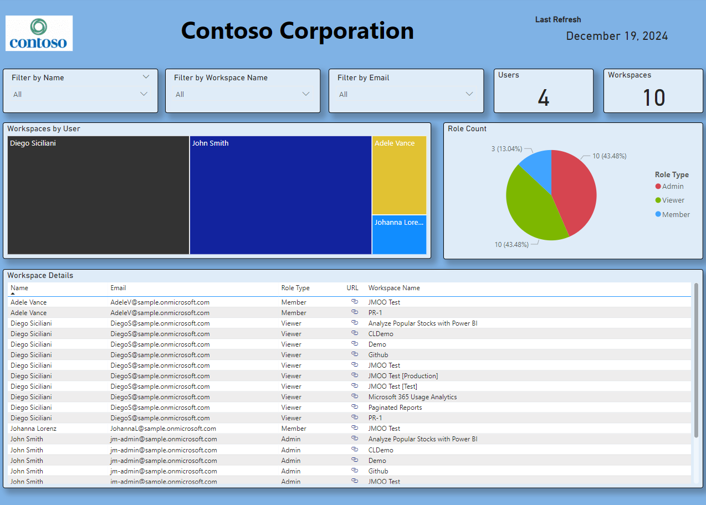

# Power BI Workspace Details Script

This PowerShell script retrieves details of all workspaces and their users in a Power BI tenant and exports the information to a text file. The script requires the user to have Fabric Administrator permissions in the M365 admin portal.



## Prerequisites

- PowerShell
- Power BI Management Module (`MicrosoftPowerBIMgmt`)
- Fabric Administrator permissions in the M365 admin portal

## Installation

Uncomment the following line in the script to install the Power BI Management Module if not already installed:
```powershell
Install-Module -Name MicrosoftPowerBIMgmt
```

## Usage

1. Ensure you have Fabric Administrator permissions in the M365 admin portal.
2. When you run the PowerShell script it will prompt you to login to retrieve workspace details:
```powershell
Login-PowerBI
```
3. The script will list all workspaces with associated users, and export these details to `output.txt` in the `samples` directory.

## Output

The output file `output.txt` will be created in the `samples` directory and will contain the following details for each user in each workspace, separated by a pipe (`|`):
- Workspace GUID
- Workspace Name
- User Name
- User Email Address
- User Access Right

## Displaying Results in Power BI

1. Open the `Workspace-Report.pbix` from the `samples` directory in Power BI Desktop.
2. Click on `Get Data` and select `Text/CSV`.
3. Browse to the location of `output.txt` and load the data.
4. Use Power BI's data transformation and visualization features to create a dashboard displaying the workspace and user details.

## Example

Here is an example of how the data might look in `output.txt`:
```
d8f76c45-a912-4e3b-8f21-9b3d4c5e6f7a| Workspace Name 1| User 1| user1@example.com| Admin
e2a9c137-8d4f-45b6-9c82-1d3e4f5a6b7c| Workspace Name 1| User 2| user2@example.com| Contributor
f1b8d249-7e3c-46a5-8d93-2e4f5c6b7a8d| Workspace Name 2| User 3| user3@example.com| Member
```

You can use this data to create various visualizations in Power BI, such as tables, charts, and graphs, to analyze the distribution of users and their access rights across different workspaces.